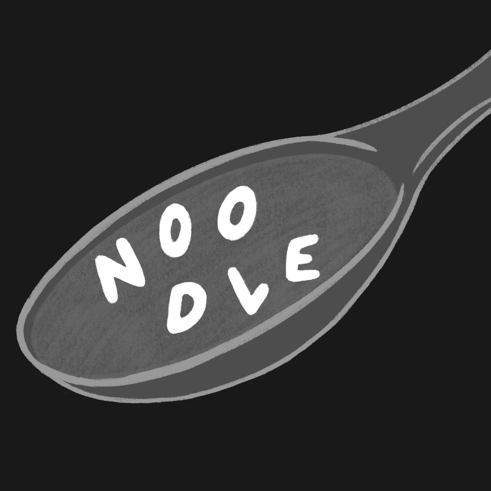

# Noodle

Wordle, except it's called "Noodle" and the word to guess is always the five-leter name of some kind of noodle, or noodle-based dish.

This is a slight modification of [Jack Carling's clone](https://github.com/jack-carling/wordle) of [Wordle](https://www.powerlanguage.co.uk/wordle/).

## How I chose which noodles to include

- I skimmed Wikipedia's lists of [noodles](https://en.wikipedia.org/wiki/List_of_noodles), [noodle dishes](https://en.wikipedia.org/wiki/List_of_noodle_dishes), [pasta](https://en.wikipedia.org/wiki/List_of_pasta), and [pasta dishes](https://en.wikipedia.org/wiki/List_of_pasta_dishes)
- I included all the 5 letter words I saw on those lists
  - (where Wikipedia lists several possible names for a dish/noodle, I only included the first one)
- I also included the 4 letter words for which Wiktionary had a page acknowledging an English plural formed by adding "-s"

## Acknowledgements

Big thanks to [Elizabeth Pankratz](https://github.com/epankratz) for this bad idea, to Jonathan Loewen for encouraging me to add more noodles than just "penne" (even though that version was *so* funny), and to Jack Carling for writing [the real code](https://github.com/jack-carling/wordle) that I tweaked to make this.
